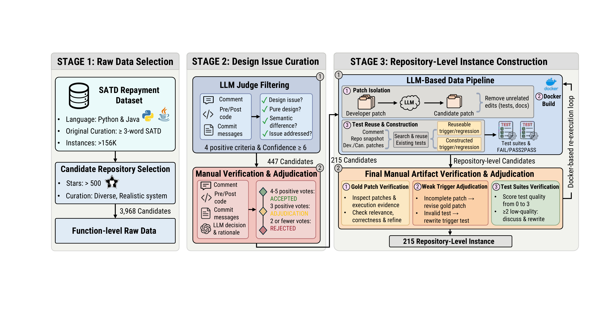

# DART

This repository hosts the public artifact for the ICSE 2027 submission:

**DART: Can SWE Agents Resolve Design Issues Admitted in Source-Code Comments?**

DART studies whether SWE agents can resolve design issues admitted in source-code comments. This repository provides the benchmark construction prompts, construction/evaluation code, example benchmark instances, and sampled agent artifacts. Additional benchmark and evaluation artifacts will be added in subsequent releases.

<p align="center">
  
</p>

## Contents

```text
figures/
  2_bench_construction.pdf
  2_bench_construction.png

construction_pipeline/
  prompts/
    task1_gold_patch_isolation.md
    task2_environment_and_existing_tests.md
    task3_trigger_test_construction.md
    task4_regression_test_construction.md
  src/
  run_pipeline.py
  docs/
  examples/

src/
  eval/
  utils/
  empirical_agents/

benchmark_examples/
  *.jsonl
  MANIFEST.csv

agent_patches_trajectory_examples/
  <agent>/<repository>/<instance>/
    patch/
    trajectory/
    eval_result/
  MANIFEST.csv
```

### Benchmark Construction

`construction_pipeline/` contains the LLM-assisted construction pipeline used to build DART instances.

- `prompts/` contains the four construction prompts:
  1. isolate the design-issue-related gold patch from the full developer patch;
  2. construct or reuse the execution environment and search existing repository tests;
  3. construct a hidden trigger test when existing tests are insufficient;
  4. construct a hidden regression test when existing tests are insufficient.
- `run_pipeline.py` is the entry point for the outer construction pipeline.
- `src/` contains the deterministic orchestration code for running the construction steps.
- `docs/` and `examples/` provide auxiliary construction contracts and example input format.

The example inputs in this repository are sufficient for inspecting the DART instance schema and construction pipeline interface.

### Agent Execution and Evaluation

`src/` contains the code for running SWE agents, collecting submitted patches, and evaluating those patches in DART environments.

- `empirical_agents/` contains wrappers for the evaluated agent families.
- `eval/` contains evaluation entry points for applying agent patches and running DART tests.
- `utils/` contains shared code for benchmark loading, Docker execution, output layout, patch handling, and trajectory processing.

Typical entry points are:

```powershell
# Run an agent on one or more DART-style JSONL files.
python src\empirical_agents\<agent_name>\<agent_name>.py --jsonl-list benchmark_examples\<example>.jsonl

# Evaluate a submitted patch.
python src\eval\eval.py --jsonl-list benchmark_examples\<example>.jsonl --agent-name <agent_name> --agent-patch-path <patch.diff>
```

The public example JSONL files are intended to document the instance schema. The full benchmark JSONL files and Docker image bundles are large and will be distributed separately.

### Benchmark Examples

`benchmark_examples/` contains one example instance per repository. These examples make the DART instance schema inspectable and provide lightweight inputs for exercising the evaluation harness.

### Agent Artifact Examples

`agent_patches_trajectory_examples/` contains one sampled artifact for each evaluated agent. All samples use the same example instance, `facebook__buck-1117`, so that patches and trajectories can be compared across agents. Each sample includes:

- the submitted agent patch;
- a compact trajectory file for that run;
- the corresponding evaluation result JSON.

For Codex and Claude Code, the trajectory file is `runner_events.jsonl`. For Mini-SWE-Agent and Live-SWE-Agent runs, the trajectory file is `mini_run.traj.json`.

The complete `output_data_batch` artifacts are large and will be distributed through external archival storage.

## Release Plan

Future releases will include:

- the full verified DART benchmark;
- Docker image bundles required for reproducible execution;
- complete agent trajectories, patches, logs, and evaluation outputs.
